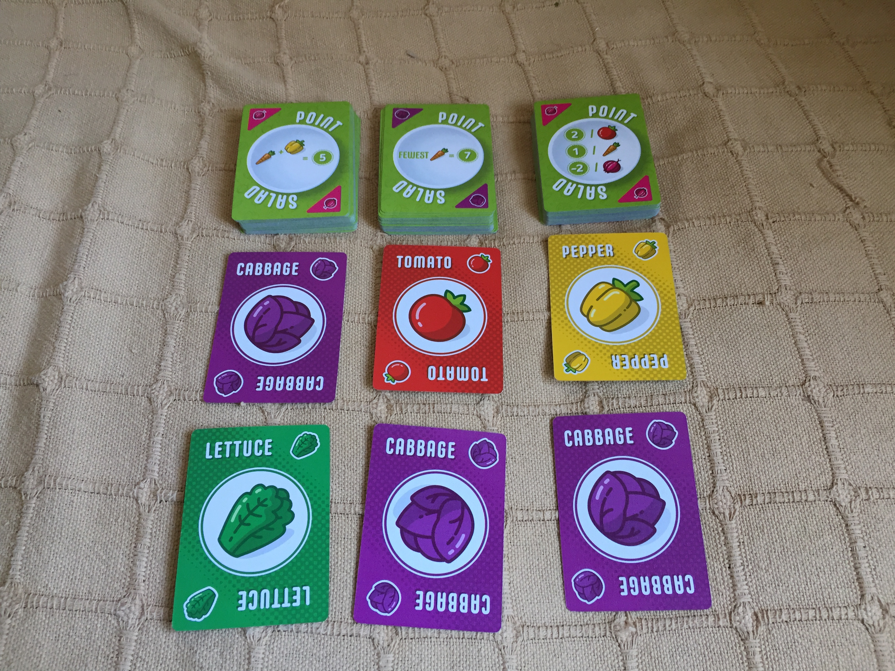

### Point Salad

#### For 2 to 6 players

Julius Caesar took lettuce, lemon, mustard and egg and made a delicious salad. Mr/Mrs Sundried tomato took a tomato and made vomit-on-a-plate. Messr’s Johnson, Melvin and Stankewich have made a small salad card game. But which way has it gone?

\
Take a half dozen salad bits, mix them up, add 1 to 5 of your friends and sit for 15-30 minutes. Garnish with a sprinkle of...actual food.

\
Point salad is made up of a load of cards with one of six different salad items on them. On the reverse of the card is a description of how one or more of those salad items will score you victory points at the end of the game. Eg. ‘2 points per onion’ or ‘8 points for each set of onion, pepper & cabbage’ or ‘3 points for each tomato, but minus 1 point for each carrot & onion’

\
On a players turn they will have a selection of cards laid out thusly

\
And players will take it in turns to do one of the following:

- Take 2 of the 6 visible salad cards
- Take 1 of the 3 visible victory point cards.

Salad cards taken are replaced with new cards from the pile at the head of their column.

\
The only other rule is that you can flip your victory point cards to their salad side if you want to at any time (But they will obviously no longer score you the points at the end of the game)

\
When all the cards have been taken, the game ends.

\
Thats it.

\
Verdict: Can’t-be-beet or Who-gives-a-toss?

\
Point salad is a really simple card game that you can teach to your friends in 20 seconds. For that reason, I think it’s a must for any game collection. Whilst a turn is straight forward, you always have decisions to make. Maybe you’ll hoard one type of salad, hoping you’ll get cards that mean they score you big points. Maybe you'll try and gain cards of all salad types

The key to this game is finding an invisible balance. There is going to be a point where a player might just have too much salad, and not enough Victory points for that salad. And on the other side, a time where you have too many victory point cards and not enough actual salad. Somewhere there is a perfect middle and your quest is to find it. However, that brings me to the big downside of this game. And that is, whilst the strategy is to find that blend, sometimes luck is just going to get in the way. A specific player who has some big points for tomatoes is just going to have tomatoes appear right when it is their turn. And that can be frustrating because there is nothing the other players can do about that. They might say to themselves they need to grab tomatoes to stop the other player getting them for big points, but those toms just keep appearing on their turn only.

But on the flip side of that, sometimes luck is good for a game. Especially a game that is only 20 mins long. A sprinkling of luck in this salad means an inexperienced player can beat someone who has played it a lot. Everyone who plays can feel like they have a chance, if things go their way. And if the deck conspires against you and the salad you pick is not what you want, the game will end soon and you can try again.
