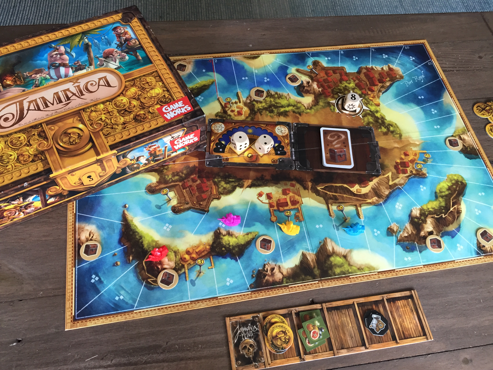
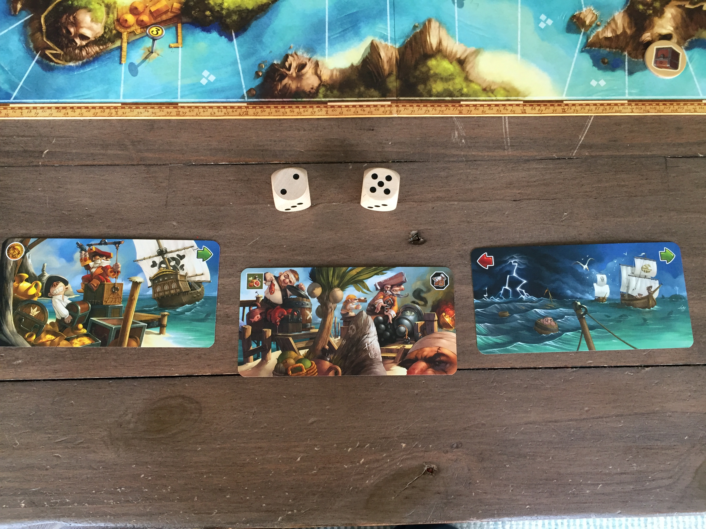
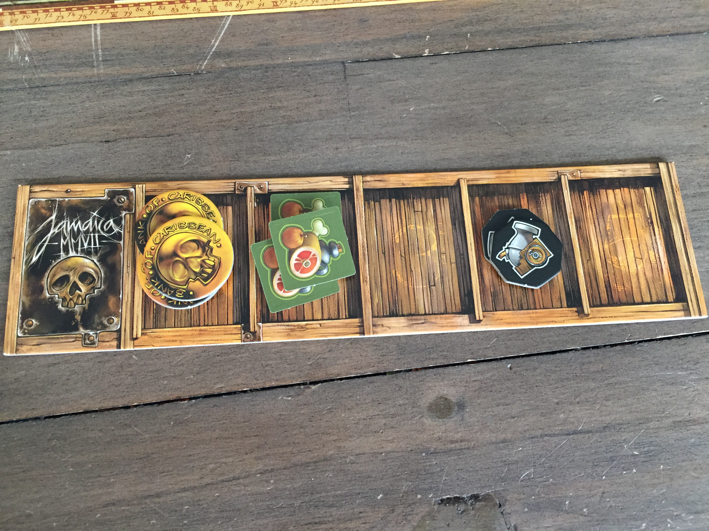
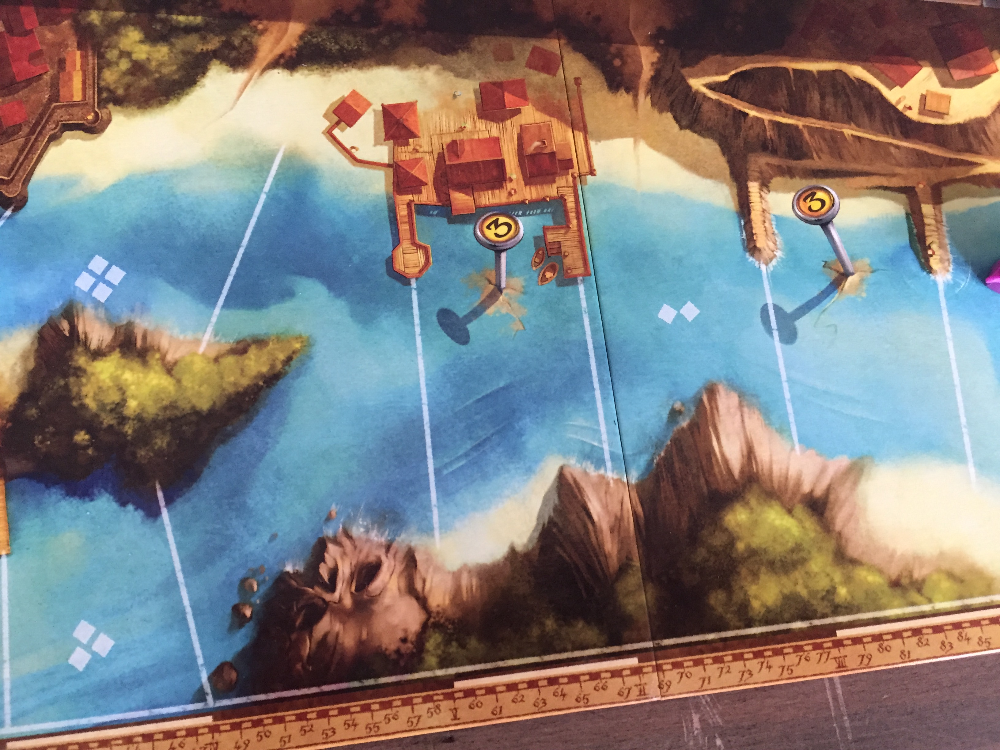
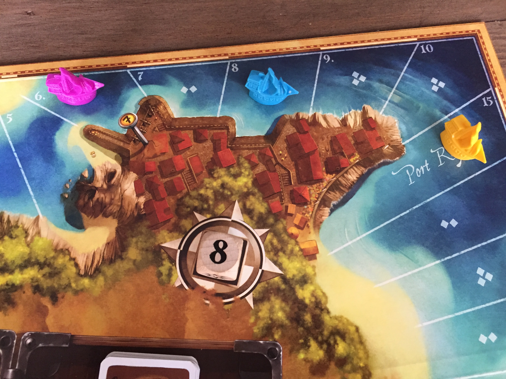

# Jamaica

## For 2 to 6 players

\
When playing a game of Jamaica you will be instantly transported to the pirating world by the stunning artwork of the game board. Your ships will be cruising around a beautiful caribbean island, strategically hoping to evade your friends one minute and attacking them the next, as you try to swipe their valuables from under their noses.

\
Each player will place their ship at Port Royal and give their personal deck a quick shuffle, drawing three cards to their hand. A game round is pretty straightforward, one player will roll the 2 six-sided dice and decide which number will be the first action and which will be the second action. All players will then have to select a card from their hand and, in turn order, carry out the two actions shown on their chosen card. The actions will be:

* Green forward arrow - Move your ship forward the number of spaces shown on the dice
* Red backward arrow - Move your ship back the number of spaces shown on the dice
* Food/Cannons/Gold symbol - Gain resources of that type equal to the number shown on the dice

\
So for example…

\
In the picture above, one player has rolled the dice and decided the 2 will be the first action and the 5 will be the second action. Each player has 3 cards in their hand and so we have the following 3 options for our turn (Note. First symbol is in top left corner, 2nd symbol is in top right corner of each card. The rest of the card is just artwork)

* Play our left card - We will gain 2 Gold coins and then move forward 5 spaces
* Play our middle card - We will gain 2 Food tokens and then gain 5 cannon tokens
* Play our right card - We will move back 2 spaces and then move forward 5 spaces

\
Each player has their own ‘ships hold’ board with five spaces to store resources. When you gain resources they are placed in one of your empty holds. If you have no empty holds the gained resources MUST replace everything already in a hold and you must be replacing a different type to what you are gaining.

\
When a player moves their ship forwards or backwards, the space they land on will often trigger a cost.

If the space has a number of small squares on it you must pay food, equal to the number of squares, back to the supply from your hold/s. Your hardworking pirates have got to eat after all.

If the space has a round gold number, you must pay that many gold coins to the supply. See it as a payment to the local town to let you dock there for the turn.

If you do not have enough food/coins to pay for the space you move to, you pay what you can and then move backwards until you land on a space that you can pay for, or a space with no cost.

If you land on a square with a treasure token, you remove the token and take a treasure card. Treasure cards will either be a special ship upgrade ability, victory points or even negative victory points!

If at any point you land on a space occupied by another player, get ready to battle! In battle the player that moved into the space is the attacker and the player that was already there, is the defender. Battle happens like this:

* Attacker decides how many cannons they want to spend from those in their holds.
* Attacker rolls the combat die (A die that shows even numbers from 2 to 10 or an explosion)
* Attackers combat value is the number on the die + number of cannon tokens spent
* Defender then decides how many cannons they want to spend
* Defender rolls the combat die
* Defender’s combat value is the number on the die + number of cannon tokens spent

Highest combat value wins. However, if either player had rolled the explosion symbol on the combat die, they would immediately win the combat.

The combat winner gets to choose their prize from the losers ship. Either a treasure card (if they have one) or the contents of one of the losers holds.

When each player has carried out the actions on their card in turn order and resolved anything in the spaces they may land on, each player will draw a new card into their hand and the next round will begin. A different player will roll the two dice and decide the order, with play continuing like this until one or more player’s ships arrive back at Port Royal.

\
At the end of the round in which one or more players cross the finish line players will add up the following to gain their final score:

* The number shown on the space a player occupies at the end of the race, if it has one (Players that arrive at Port Royal gain 15 points)
* The number of coins in their holds
* The number of victory points from treasure cards, subtracting any negative victory point treasure cards.

The winner of the game is the player with the most points, so not necessarily the player who crossed the line first.

## Jolly Roger or Ship’s mess?

Jamaica is a very straight forward game to play. You have 3 cards in your hand, you pick one and your ship will move, or you’ll gain resources, or both. For this reason anyone can play the game. Pick a card and see what happens. You’ll pick the strategy up as you go along. And there can be a fair bit of strategy despite the simplicity of turns. You want to get round the board quite quickly. Grabbing treasure cards before other players, can get you great upgrades or victory point cards, but it then makes you a target for other players as they will want to steal your precious treasure from you. Maybe you just load up on cannons and spend your time stealing the resources you need from everybody else! All the resources are important in some way, so as long as you’re not neglecting any of them, you should do ok.

And managing your resources becomes its own little mini game. When you gain resources, and the cards will force you to gain resources, they replace resources already in your hold. So juggling these and collecting the right resource at the right time can enable you to cruise round the board more efficiently.

I love the simplicity of combat. Cannon tokens plus the die roll gives you your combat score. But the explosion side of the dice means combat is always tense. A player who might be having a rough time and seem like the underdog can still grab a victory out of nowhere.

Another interesting side plot are the victory point treasure cards. They can be big points. But they can also be big minus points. But your opponents won’t know what you found because you can keep it secret. And then when you fight them, they might steal your cursed treasure if they win. And if you win, you have the option to give them the cursed treasure rather than stealing something of theirs!

If it’s not obvious by now, I love Jamaica. It’s a fun game with a lot of great interaction between players and is not going to take too long to play even with 5 or 6 players. I would however not recommend this game for 2 players. There are rules that add a third dummy player, but it will sink at 2 players. It will be fine with 3 players but really the game will be at its best with lots of combat, players landing on each other's spaces so 4-6 players is really the best here.

One final note to say the rulebook is.....odd. Instead of a book, it’s a big fold out map and it is totally impractical. Thankfully you won't have to read it very often because the rules are pretty straight forward. Grab your crew and hop aboard!

### The Gamekeeper Final Score:

#### Pieces of 8.5/10