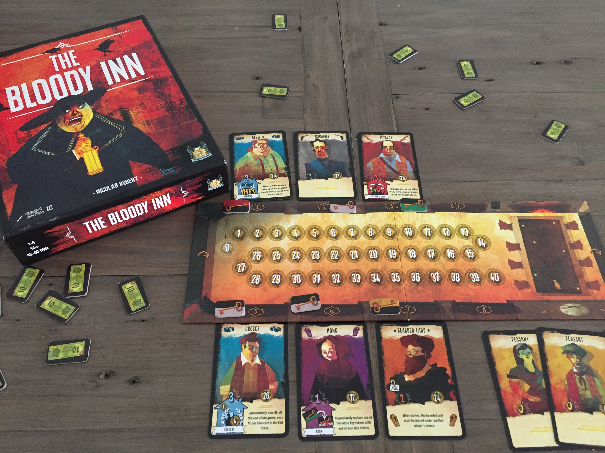
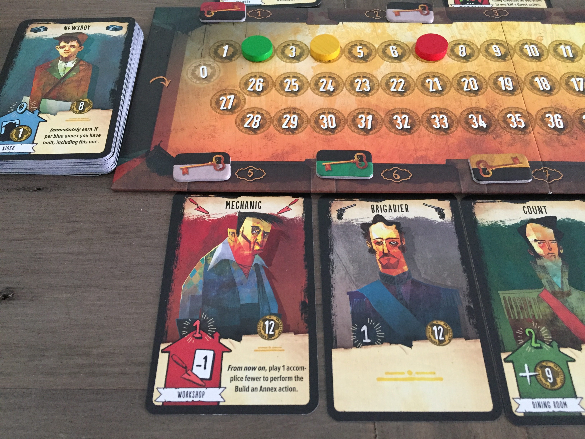
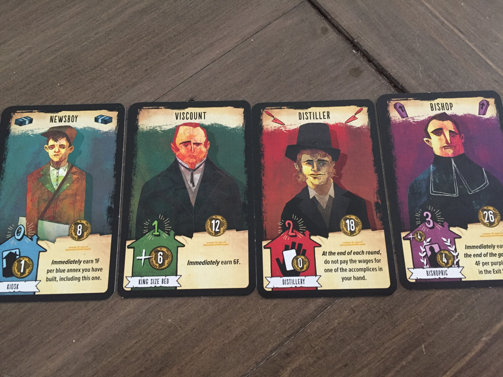
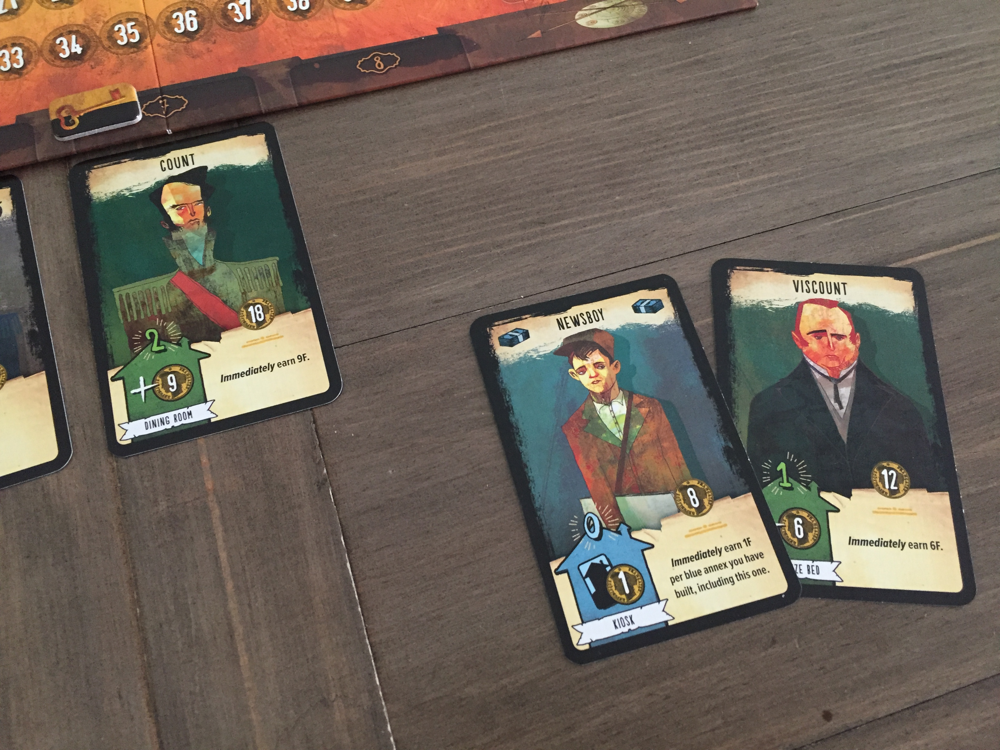
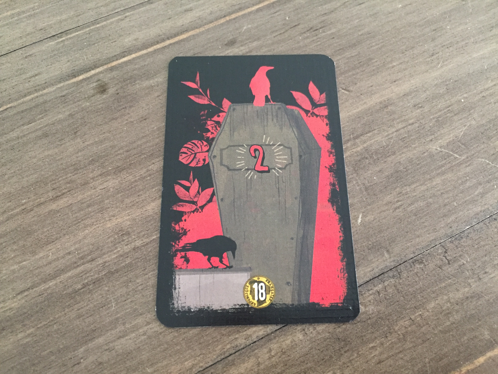
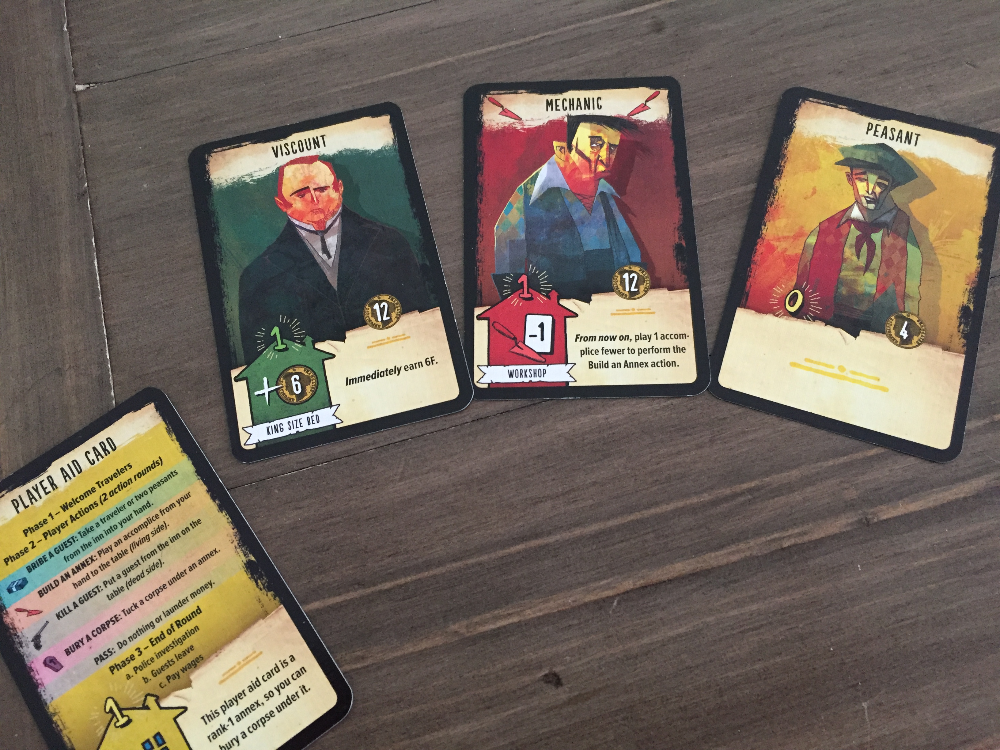
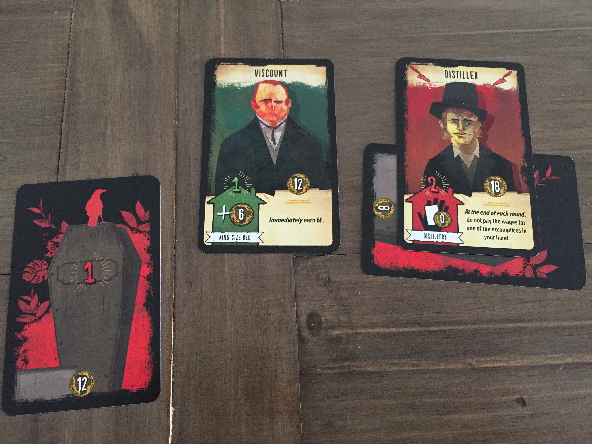
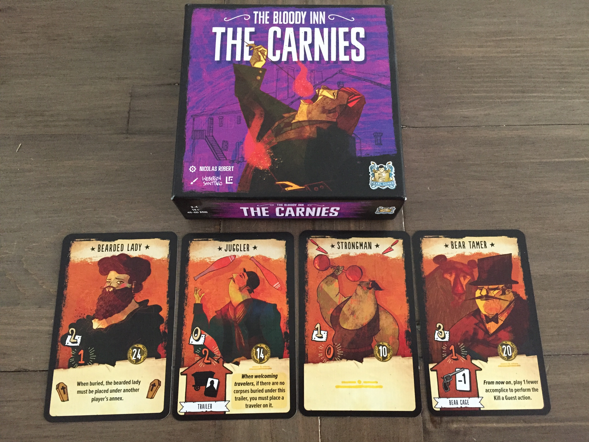

# The Bloody Inn

### For 1-4 Players

### Age: 14+

In ‘The Bloody Inn’ players take on the roles of a greedy family running an inn, the winner being the richest player at the end of the game. A small bit of your income comes from guests paying for rooms, but if you really want to earn big bucks, you’re going to have to partake in multiple hospitality fatalities. Shoot them and bury them without the cops noticing. Here’s the bare bones of it…

Each player is going to start the game owning one room of the inn marked by a key token in their player colour. At this stage some of the rooms will be owned by nobody, marked with a grey key token. A round begins with the first player welcoming guests to the inn by drawing from the deck of cards, filling each room with 1 guest, until all rooms with a key token have a guest assigned to them.

The main phase will now begin as players interact with the guest cards in the inn and also those in their hands, known as accomplices. There are four actions players can perform:

* Bribe a guest
* Kill a guest
* Build an annex
* Bury a corpse

The part of the guest card I want you to focus on first is the left hand number showing between 0 and 3 that denotes the guest’s rank. This is the number that shows how many cards (accomplices) you must play from your hand to carry out any of the four main actions onthisguest card.

The symbol in the top right of each card is one of four symbols that each represent one of the four actions.

* Money = Bribe
* Gun = Kill
* Trowel = Build annex
* Coffin = bury a corpse

If any of the accomplices you play to carry out an action, have the symbol of the action, those accomplices will return to your hand once the action is complete. Cards that do not have the symbol will go to the exit pile (discard pile).

So for example, if we want to bribe the Viscount from the image above, he is a rank 1, so we will need to play 1 accomplice from our hand. If the accomplice we play has the Money symbol, that accomplice is deemed to have an aptitude for bribery and returns to our hand. If they do not have the Money symbol, the card will be discarded to the exit pile. That accomplice has decided their ‘association’ with us is over.

So what do the actions do…

\
Bribe and Murder both relate to guests that are situated in rooms of the inn, so i’ll explain those first. In the image above let’s imagine I want to bribe the Count. Bribing means you take that guest and place them into your hand of accomplices. He is a rank 2 so I have played two cards. I take the Count and add him to my hand. Of the two cards i played, the Newsboy has an aptitude for bribery (the money symbol), so that card will come back to my hand of accomplices while the other card, the Viscount, will be discarded to the exit pile.

If i were to instead decide to *Kill* the Count, he is rank 2 so i still need to play two cards. Let’s say I played the same two cards from my hand as in the image above, neither of which have the kill symbol (a gun), so both will be discarded to the exit pile. When a guest is killed, you flip the card to its ‘dead’ side and place it on the table in front of you. There is no limit to the amount of dead guests you can have in front of you. 

Here’s a dead Count.

\
The dead side reminds you of the rank of the guest and also shows you the other number from the guest card that I have not yet explained. It has a coin behind it and is how much money this guest has on their person. The higher the rank, the more money they will carry. You will gain this money only when you *bury* the guest

So we have seen that you can bribe guests into your hand and you will likely be wanting to grab accomplices who have an aptitude for the action you intend to carry out next. Another reason you will want to bribe certain guests is because of their annex ability which will help us if we carry out the third action, build an annex.

\
Building an annex is carried out using one of the accomplices in your hand and grants you the ability of the text in the bottom section of the guest card. The image above shows an example of a hand of accomplices we might have.

To build an annex you place the guest card face up in front of you and play a number of cards from your hand equal to the guests rank number as usual. Remembering that any cards we play with the build annex trowel icon will come back to our hand.

The face up guest whose annex we have built will now either grant us an instant or ongoing ability.

For example, we could build the annex of the Viscount card in our hand. His card would go on the table and we could play the Mechanic card to pay for it. As the Mechanic card has the ‘Build annex’ aptitude symbol (Trowel) he will come back to our hand. The Viscount annex immediately awards us 6 money. If we were to instead build the annex of the Mechanic card and play one of the other cards from our hand to pay for it, his annex grants us an ability for the rest of the game that states: ‘From now on, play 1 accomplice fewer to perform the Build an Annex action’.

And finally the fourth action we can play is ‘Bury a corpse’. Simply choose a dead guest from in front of you, play cards from your hand according to its rank and place the card under an annex. Gain money equal to the coin number on the guest card. Any of the cards you played with the ‘bury a corpse’ symbol return to your hand.

\
An annex can only hold a number of corpses equal to its Rank number. So in the image above, the annex of the Distiller card already has one corpse buried under it. Fortunately as it is a Rank 2 card, it can hold one more corpse. We could alternatively bury the corpse under our Viscount annex as it has space for one corpse.

If you do not have room for the corpse in one of your annexes you can bury it in an opponent's annex. You must, however, split the loot with that opponent.

Another thing to be aware of, is the presence of Peasants. They are a special type of guest, limited in number (players start with 2 each) and when you play them from your hand to perform actions, they return to the bistro pile rather than the exit pile. When you take a bribe action, you can choose to take 1 or 2 Peasants into your hand from the bistro rather than bribing a normal guest.

When every player has performed one action in turn order, everyone performs a second action in turn order, after which, the round ends. At the end of a round the following happens:

* If there is a grey card (Policeman) still in the inn, any player with unburied corpses in their possession loses the corpses and must pay 10 coins to the supply per corpse. This represents the players having to hire the local gravedigger to help them out.
* Each player earns 1 coin for each room of the inn in their colour that is still occupied by a guest. All guests in rooms are then discarded to the exit pile.
* Players must pay wages of 1 coin for each accomplice in their hand.

\
A new round begins with the next player welcoming guests to each room of the inn with rounds continuing until the entrance deck has been depleted. The exit stack is then shuffled and becomes the entrance deck again (The guests clearly can’t wait to stay at the inn for a second time). The game ends when the entrance deck is depleted for a second time.

One final thing to note. There is a fifth action that the rulebook states you can leave out when you are new to the game and I definitely agree. It is to ‘Launder money’ and basically means you have to spend precious actions every now and then to manage your money or you risk losing some when you reach a certain amount. Feel free to include it in your games when you feel ready.

### Hotshot or Grave Mistake?

The Bloody Inn is one of my favourite games to look at, it is visually stunning. It obviously has a grim, dark theme that could put some people off, so therefore it may have been tempting to go with more lighthearted or comical artwork in a bid to make the game less grotesque. But I love how the illustrations give it an almost cinematic quality. The different characters that enter the inn just ooze character and look as though any of them could, quite rightly, be a murderer. And that’s before you add the expansion ‘Carnies’ which for me was a must-buy because I was so eager to add even more colourful characters to the massacre.

\
My recent reviews have been of games with simple rules sets, and while I think The Bloody Inn is a step up in complexity, I hope my explanation has shown that it is still fairly straightforward to play. I also like how the game doesn’t have lots of other little rules that you might need to keep checking. There are a fair amount of annex abilities but I think they are explained in a clear way on the cards and there is a section in the instruction manual that ensures they make sense as well.

That said, I do think that while the rules can be easy to grasp, playing the game can be a bit more of a challenge. And by that I mean, the game is tricky to play *well*. When you’re new to the game, it can feel like you're running through treacle, you have just two actions per round and the round can pass you by and you haven’t got anything done. Maybe you’ve spent a whole round just drawing (bribing) a couple of cards into your hand. The positive spin on that would be that the game therefore has a lot of replayability. Each time you play you will think about where you could have played more efficiently and set out to do better next time.

My favourite part of the game by far, is the police investigating at the end of a round. Anyone with corpses when a cop shows up, may have to lose them and pay a penalty. It creates such great tension between players. There might be multiple players with corpses and not enough actions to bury them. So someone is going to have to bribe or kill the cop. But maybe the players don’t want to use up an action doing that. So it becomes a mini game of chicken, who will give in first and negate the danger. Also, during rounds when no cops turn up, suddenly it’s a bloodbath. Everyone wants to get those murders in while the coast is clear. It’s an incredibly clever mechanism that creates amazing tension and on top of that a compelling narrative for players to experience

Other than the main negative, that playing the game *well* can be difficult, I really don’t have many other complaints here. They really are very minor. I think the beginning of the round where a player ‘Welcomes guests’ and places them in each room of the inn is a bit slow for me. There is a basic strategy; you want to put the guests that you think no one will remove from the room, in the room/s you own. So you’re more likely to gain money from them at the end of the round. It just slows the game down a bit while a player contemplates what is ultimately a very minor decision in the grand scheme of things. The rulebook actually suggests a variant where guests are just placed in room number order, so it's random. I think I prefer it this way, but some people may disagree so just do it the way you want.

Another very small thing, from a thematic point of view, I think the names of the actions are a bit strange. When someone uses the term ‘bribing’ all I think of is money changing hands. So it seems unnatural that in the game you are actually just drawing cards into your hand. No money is transferred. And on top of that the symbol for the action is a wad of cash. I think maybe it can cause confusion for what the action is. But maybe that's just me.

And again from a purely thematic viewpoint, ‘Build an annex’ is a strange term to be using. Are my accomplices and I actually building these places to bury the corpses in? They are given names on the card and some examples are: Butchers shop, Park, Brewery, Chapel. I’m not saying I have a better term, but it doesn’t quite fit in with what’s happening in the game that we have time to build a butchers shop. Something like ‘Expand your operation’ may not roll off the tongue, but i think gaining these new locations in this way, makes more sense thematically. I stress, this is a very minor complaint and obviously doesn't affect the gameplay, but can make the game easier to understand for new players.

The Bloody Inn is a really good game, the theme is going to split people. I love it, but I can understand it’s not for everyone. There are so many board games, and there are themes that get repeated so often. When a game like this exists with such a unique theme, I think it deserves to be lauded. I would much rather new games be made with unusual themes like this, than the same old Fantasy or Cthulhu or Cowboys.

### The Gamekeeper Final Score:

*So much bang for your buck*

### 7.5/10