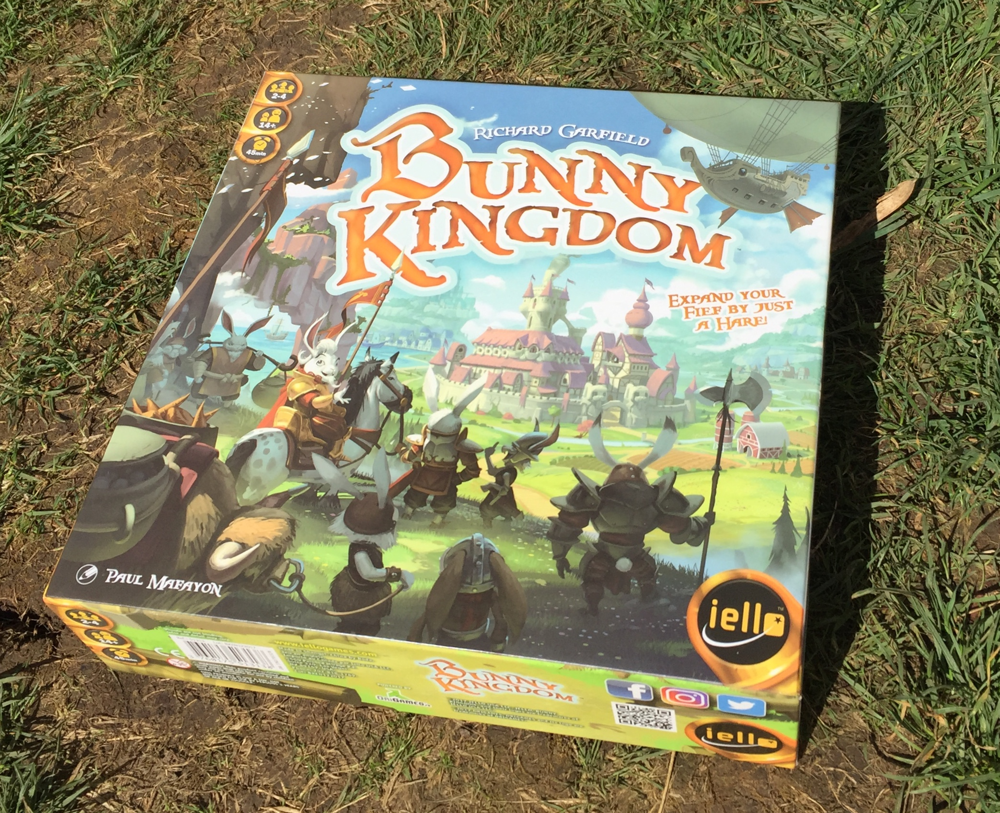
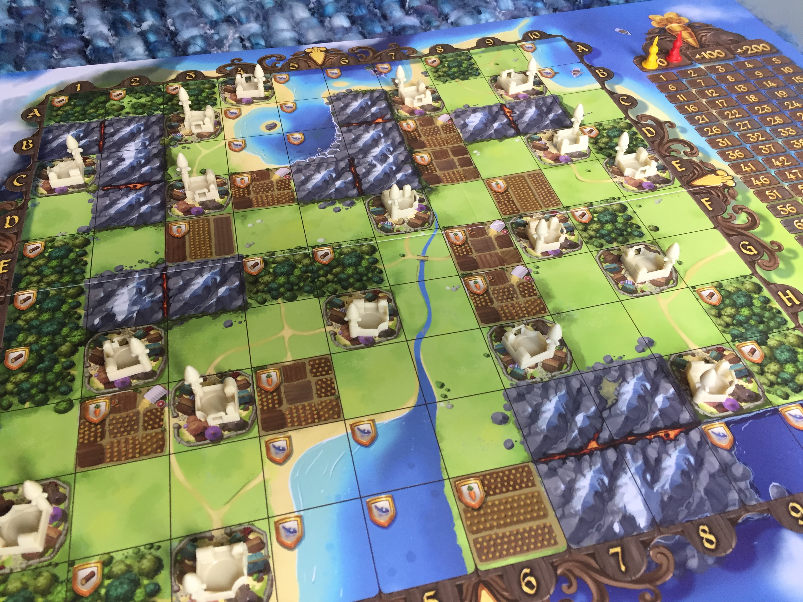
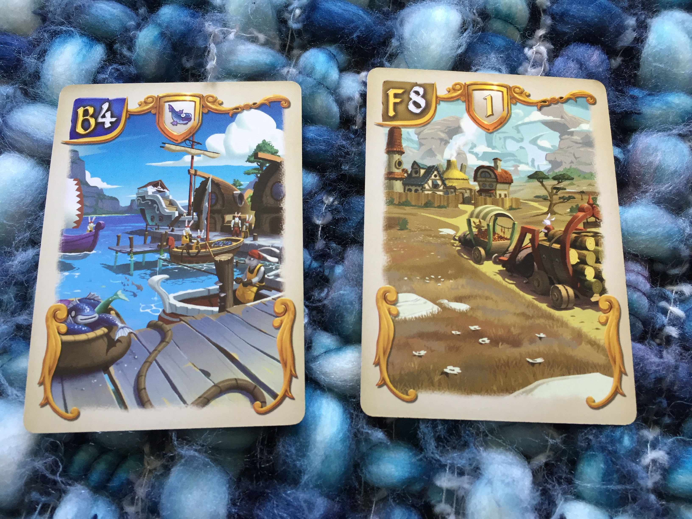
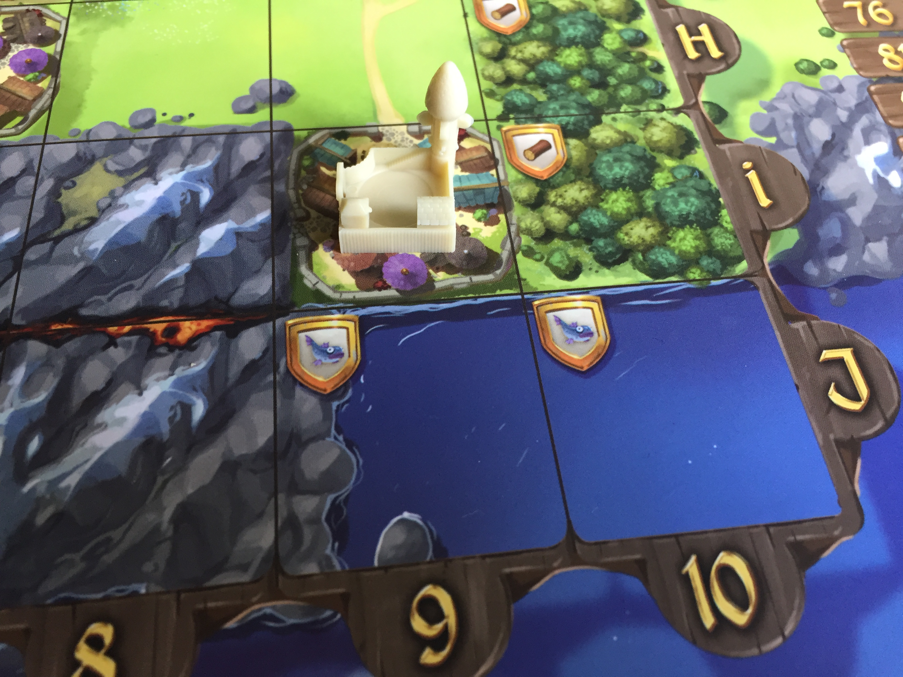
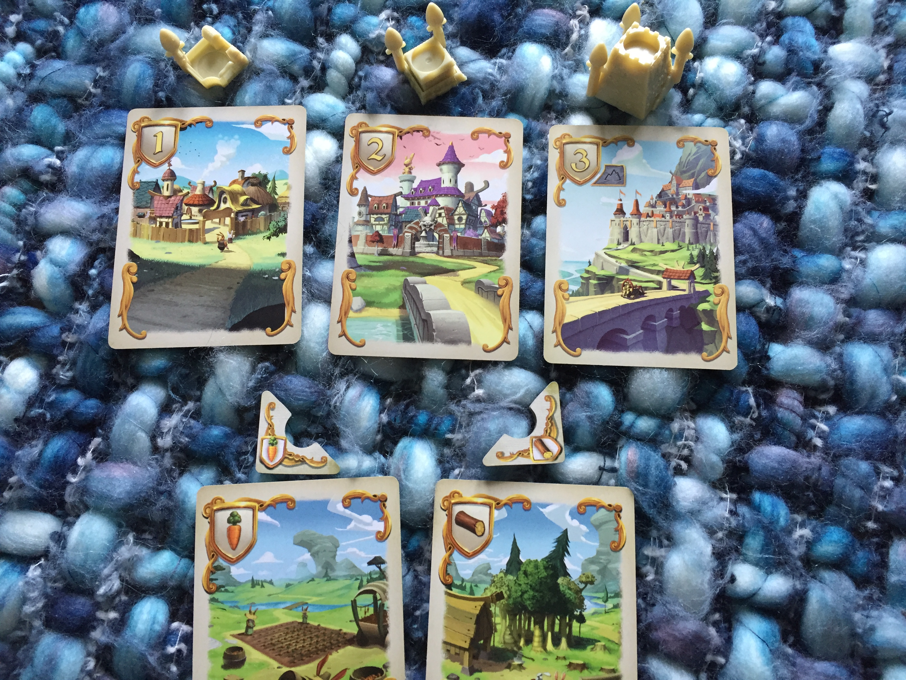
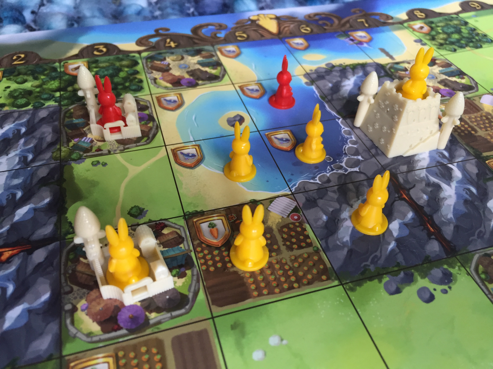
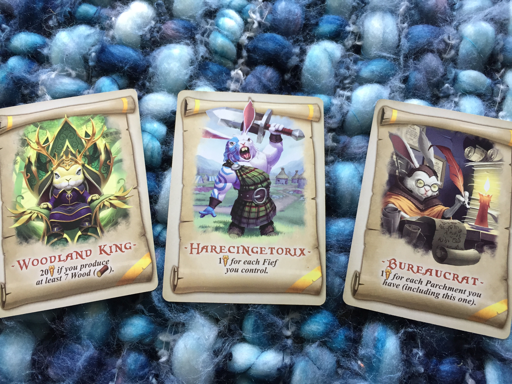
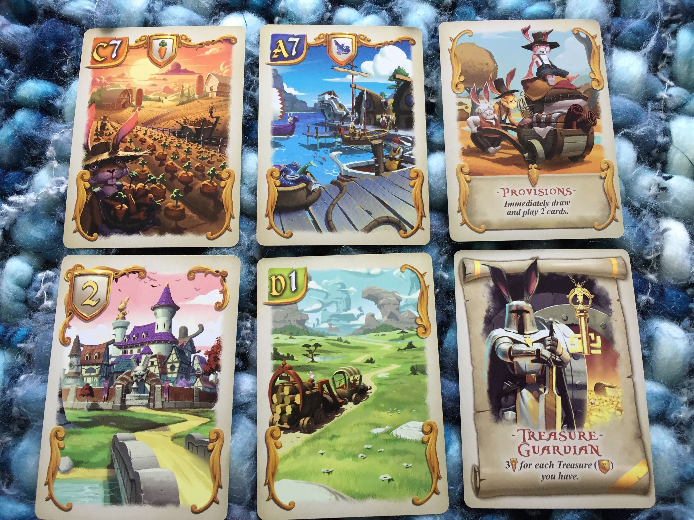

A small bunny sits on his Grandpa's knee.

*You helped settle our great Fiefdom didn’t you Grandpa Bunny?*

*I did Billy. Believe it or not, we didn’t always live in these beautiful buildings and castles. I don’t even recall what we lived in before that.*

*Warren?*

*His memory’s worse than mine. We got to these lands the same time those red rabbits did. Twas a harsh first winter as we jostled for the best territories. I got hit by many a projectile.*

*Snowball?*

*She was always out on her fishing boat so missed most of the conflict. But worse than those red rabbits was the agony of working out on the plains. Got bitten left, right and centre by God knows what.*

*Bugs?*

*Nah, Bugs was too busy cultivating the carrot pastures. When I had a big dispute with the Mayoress over land ownership, he tried to hold me back.*

*Thump ‘er?*

*Yes. She died.*

## Bunny Kingdom

### For 2 to 4 players

### Age: 12+

The Kingdom of Bunny starts as a big, sprawling, beautiful, but mostly empty, board of promise. Territories (squares of the grid) featuring lakes, mountains, carrot fields, forests and plains are just waiting to be sprinkled with colourful bunnies and buildings. Each of the four rounds begin with all players drawing a hand of 10 cards (12 in a three player game) choosing two cards they want, passing the rest on to be picked up by their neighbour and then actioning the pair of cards they selected. This continues until the hands are plucked to nothing with players scoring points at the end of each round once buildings have been placed. That's it. That's how you play!

Now all you need to know is what the different cards do:

#### Coordinate cards

Every territory square of the 10x10 board has a card in the deck that depicts its coordinates. If you select such a card, you get to place a bunny of your colour on that square and it will live there for the rest of the game. In the two cards above we have B4 which has a fish symbol in the upper centre area. This tells us, without having to check the board, that it will be a lake square providing us with a fish resource. F8 has a 1 symbol, this tells us that this square contains a level 1 city ready to place our bunny in. (More on cities/buildings shortly)

You want your bunnies in territories that are adjacent to each other and generally, you want to be trying to get large groups of adjacent bunnies. A group of bunnies is called a fief (in the game, not in real life)

Lake squares produce fish, forest squares produce wood and carrot field squares produce orange vegetables and you will want your fiefs to contain at least one of these resources, preferably all three.

#### Buildings cards

You’re also going to want to be drafting cards that grant you buildings to place in your fiefs and these come in two varieties. The upper row in the picture above, will provide you with plastic city buildings that have 1, 2 or 3 spires and you want your fiefs to contain lots of spires. Note that the level 3 city card has a small mountain icon, which instructs you that it MUST be placed on a mountain space. The lower row in the picture are examples of cards providing flat cardboard buildings and can be placed to provide further unique resources to your fiefs. For example the left hand card lets us place the carrot token. We can place this on one of our bunnies on the board to allow that territory to provide us the carrot resource. The card on the right does the same thing but provides a wood resource. No square can contain more than one building.

At the end of a round each fief will score its owner golden carrots (victory points) equal to the total number of spires on the plastic cities in the fief multiplied by the number of unique resources in that fief.

So for example….

Here is a fief controlled by the yellow player. It is made up of 6 adjacent bunnies. The fief has 4 spires (level 3 city + level 1 city) and two different resources (Carrot and Fish). At the end of the round we multiply spires x resources (4 x 2) to score us 8 points for this fief. 

So you want to be drafting coordinate cards to place your bunnies on the board and you want to be drafting cards that provide buildings to place into your fiefs so they actually score you some points each round. Each territory square can only house one type of building but you are always free to draft building cards regardless of whether you currently have the fief real estate to place it in. You can just place the building on to the board later on when you do have room. The territories provide the 3 resources of fish, wood and carrots but, when drafting, keep a lookout for cards that provide you with other unique resource buildings (Gold, diamonds, pearls etc)

#### \

Parchment cards

Parchment cards look like a big old scroll (or parchment). Each one will give you and you alone, a mission to complete that will score you juicy victory points at the end of the game. Such as, 2 points for every fish square you own. Or 2 points for every territory you control on the edge of the map. And of course, these are so very tempting as well!! You will want these because the lure of points is just too much. There are lots of them so you will have plenty of chances to draft some and they give you a further headache when choosing cards for the rest of the game but like everything up to now, it’s one of those fun headaches that only rabbits get.

### Carrot Gold or Flop-sy?

I think Bunny Kingdom is an excellent board game. It’s rules are simple enough for families, but has enough strategy for more experienced gamers to sink their teeth into.

My favourite thing about it is that every hand you pick up is like being offered a selection box of your favourite chocolate bars. You want everything. But you can only pick two and you might not see the others again. And you’ll look at your friends and they’ll be agonising over their own decisions. Everyone will be happy with the options they have just like real bunnies are happy with their options.

A turn off for me with some pick-and-pass drafting games is that occurrences of hate drafting can start to creep in. Deliberately picking something that’s not necessarily good for you solely so your opponent can’t have it. But in this game it’s not as prevalent. You’ll find yourself passing the hand on to your opponent and saying “You are really gonna like one of those cards i’m passing on” like you’re doing them a big favour! And this happens time and again because there’s usually something that you’d rather have for yourself that’s infinitely more tempting than a territory square that your opponent needs.

The other thing is drafting games don’t generally work well with two players. You often can’t help but hate draft and you’re also gonna keep seeing the same cards going back and forth. But Bunny Kingdom has 2 player rules that I enjoy, where each player has a hand of cards in reserve that cards are taken from and added to the real hands of cards meaning it stays fresh and interesting.

The theme of this game may instantly put some people off. A game about rabbits might suggest a lack of substance. But the gameplay is really engaging and you have a ton of interesting decisions. The art on the board and cards is amazing, you will not be able to take your eyes off it and I really am finding it hard to come up with any negatives. The main negative for me would be the end game scoring. It can be a bit math heavy. Adding up all the fief scores and all the mission scores with a fairly crowded board can be hard work. I find if players don’t discard their cards after use and display them nicely with other cards by type, it can make adding up totals at the end a lot easier. For example, if i have a parchment that scores me two victory points per rabbit that provides a fish resource, the cards laid out in front of me will show how many i have, so i don't have to laboriously scan the board. Though splaying your numerous cards out in this way is kind of dependent on having a large table.

### The Gamekeeper Final Score:

*This Rabbit’s a bit gamey*

#### 9/10